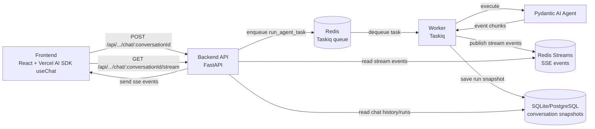
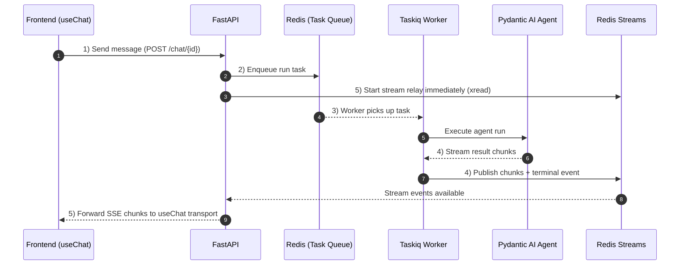

# Pydantic AI Chat UI

A React-based chat interface for [Pydantic AI](https://ai.pydantic.dev/). This package powers the documentation assistant at [ai.pydantic.dev/web/](https://ai.pydantic.dev/web/).

Built with [Vercel AI SDK](https://sdk.vercel.ai/) and designed to work with Pydantic AI's streaming chat API.

## Features

- Streaming message responses with reasoning display
- Tool call visualization with collapsible input/output
- Conversation persistence via localStorage
- Dynamic model and tool selection
- Dark/light theme support
- Mobile-responsive sidebar

## Architecture



Redis has two distinct roles:

- Task broker for Taskiq (`ListQueueBroker`, queue-based task dispatch)
- Streaming transport for AI output (`Redis Streams`, chunk/terminal events)

## Request Lifetime



## Development

Requires [Docker](https://docs.docker.com/get-started/get-docker/) for Redis.

```sh
pnpm install
pnpm run dev:full    # start Redis (Docker) + frontend + backend + Taskiq worker

# or run each service separately:
docker compose up -d redis  # start Redis
pnpm run dev:server          # start the Python backend (requires agent/ setup)
pnpm run dev:worker          # start the Taskiq worker
pnpm run dev                 # start the Vite dev server
```

## License

MIT
